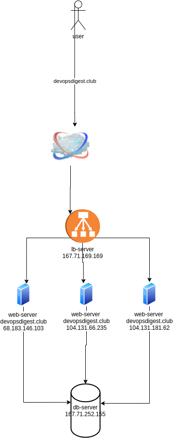

# infrastructure-as-code
Main repo for working on IaC

```
ansible all -a "apt update" -u root
ansible all -a "apt install nginx" -u root
```

```
ansible-playbook -i inventory playbook.yml
```

```

``` 
